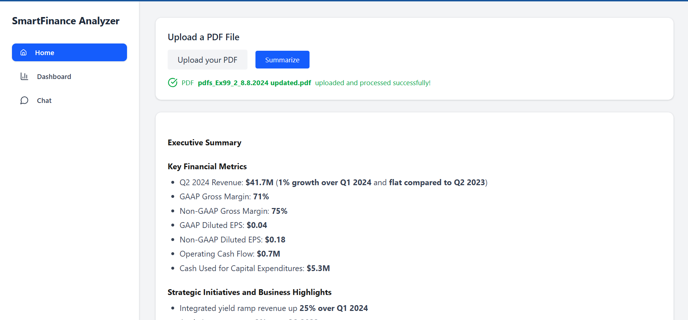
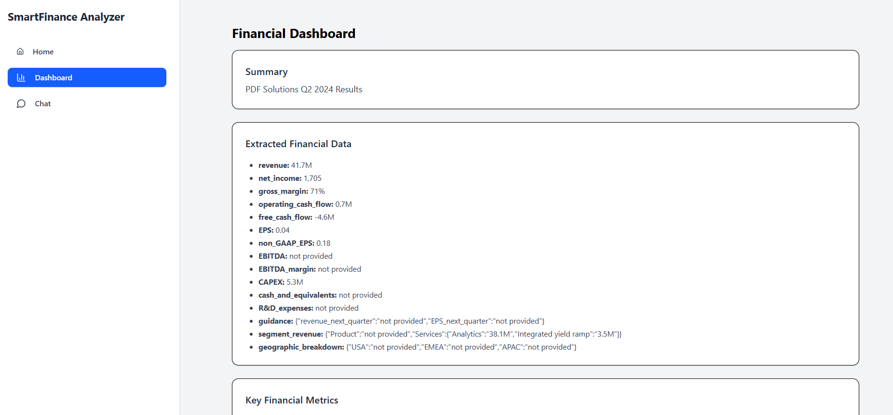
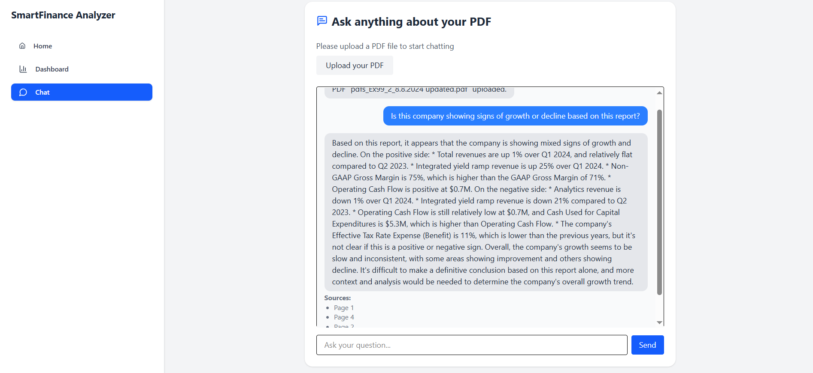

# 💼 SmartFinance Analyzer

**SmartFinance Analyzer** is an end-to-end AI-powered platform that enables Investor Relations (IR) and Financial Teams to automatically extract, summarize, and analyze insights from corporate financial reports (PDFs).  

Built with **FastAPI**, **LangChain**, and **React.js**, it leverages the latest LLMs (e.g. LLaMA3 via Groq API) to deliver intelligent summaries, visual dashboards, and an interactive QA chatbot.

---

## 🌟 Key Features

| Module            | Description                                                                 |
|-------------------|-----------------------------------------------------------------------------|
| PDF Upload     | Upload any financial PDF instantly                                           |
| Executive Summary | Generates a clean, bullet-point business summary with key figures         |
| Financial KPIs | Automatically extracts key indicators: revenue, margin, FCF, CAPEX, etc.    |
| Chatbot         | Ask questions interactively about the uploaded PDF                         |
| Dashboard       | Visualize metrics with dynamic bar and pie charts                          |
| Export          | Download structured financial data as CSV                                  |

---

## 🧠 Tech Stack

| Layer      | Technology                                                                 |
|------------|----------------------------------------------------------------------------|
| Frontend   | `React.js`, `Vite`, `Tailwind CSS`, `Chart.js`, `Lucide Icons`             |
| Backend    | `FastAPI`, `Python`, `LangChain`, `Groq API (LLaMA3)`, `PyMuPDF`           |
| AI Engine  | `LangChain RAG`, `Prompt Engineering`, `QA + Summarization Chains`         |
| Deployment |  ----                                                                      |

---

## 🗂️ Project Structure

```

smartfinance-analyzer/
│
├── backend/                # FastAPI application
│   ├── main.py             # Entry point
│   ├── routers/            # PDF, Finance, Chatbot endpoints
│   ├── services/           # LangChain agents & pipelines
│   ├── core/               # Middleware & shared config
│   ├── .env.example        # Example backend environment variables
│   └── requirements.txt
│
├── frontend/               # React + Tailwind interface
│   ├── src/
│   │   ├── components/     # UI elements: PdfUpload, Chatbot, DashboardCards
│   │   ├── pages/          # Page-level logic: Home.jsx, ChatBot.jsx, Dashboard.jsx
│   │   ├── context/        # React Context: TabContext
│   │   └── services/       # Axios API services
│   └── .env.example        # Example frontend environment
│
├── README.md               # Global documentation (this file)
└── .gitignore

````

---

## ⚙️ Installation Guide

### 1. Backend Setup (`/backend`)

> ✅ Python 3.10+ recommended

```bash
cd backend
python -m venv venv
source venv/bin/activate      # (or venv\Scripts\activate on Windows)
pip install -r requirements.txt
````

Create a `.env` file:

```env
PORT=8000
GROQ_API_KEY=your_groq_key_here
MODEL_NAME=llama3-8b-8192
LANGCHAIN_API_KEY=your_LANGCHAIN_API_KEY
```

Run the server:

```bash
uvicorn main:app --reload
```

---

### 2. Frontend Setup (`/frontend`)

> ✅ Node.js 18+ recommended

```bash
cd frontend
npm install
```

Create a `.env` file:

```env
VITE_BACKEND_URL=http://localhost:8000
```

Run the app:

```bash
npm run dev
```

---

## 📦 API Overview

| Method | Endpoint                                       | Description                    |
| ------ | ---------------------------------------------- | ------------------------------ |
| POST   | `/pdf/upload`                                  | Upload a PDF                   |
| POST   | `/pdf/extract`                                 | Extract raw text from PDF      |
| POST   | `/pdf/summarize`                               | Generate executive summary     |
| POST   | `/pdf/qa`                                      | Ask question about the PDF     |
| POST   | `/api/finance/extract-financial-info-from-pdf` | Extract key metrics            |
| GET    | `/api/finance/export-csv`                      | Download extracted data as CSV |

---

## 🖥️ Demo Screenshots

### 📄 Upload & Summary       


### 📊 Financial Dashboard 



### 💬 Chat Interface



---

## 🧭 Roadmap

* [x] Executive Summary Generator
* [x] Financial KPI Extraction
* [x] Chatbot with PDF context
* [x] Interactive Dashboard
* [x] CSV Export
* [ ] PDF-to-Word/Excel export
* [ ] ESG & News module (optional)
* [ ] User Authentication (JWT)

---

## 👤 Author

**Yamina Atmaoui** –
M2 AI Engineering – MERN Dev
[LinkedIn](https://www.linkedin.com/in/atmaoui-yamina-4988a3220/)

---

## 📝 License

This project is licensed under the **MIT License**.
---
